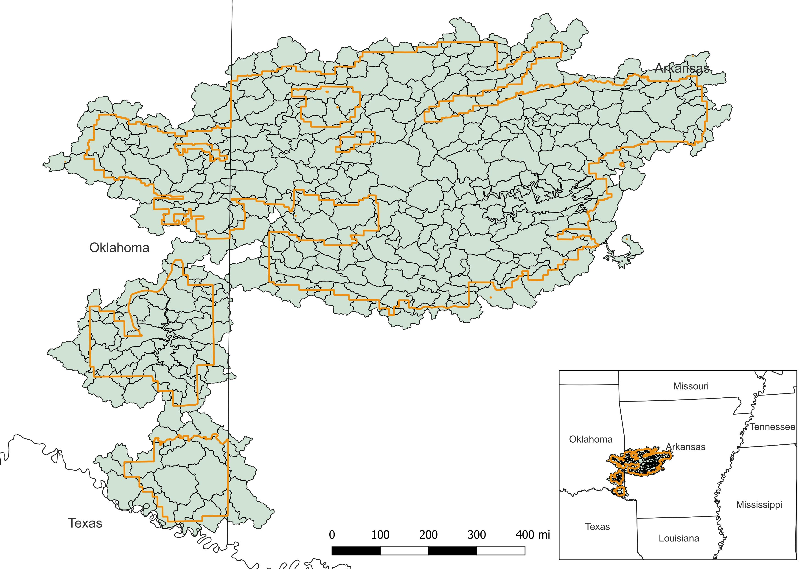
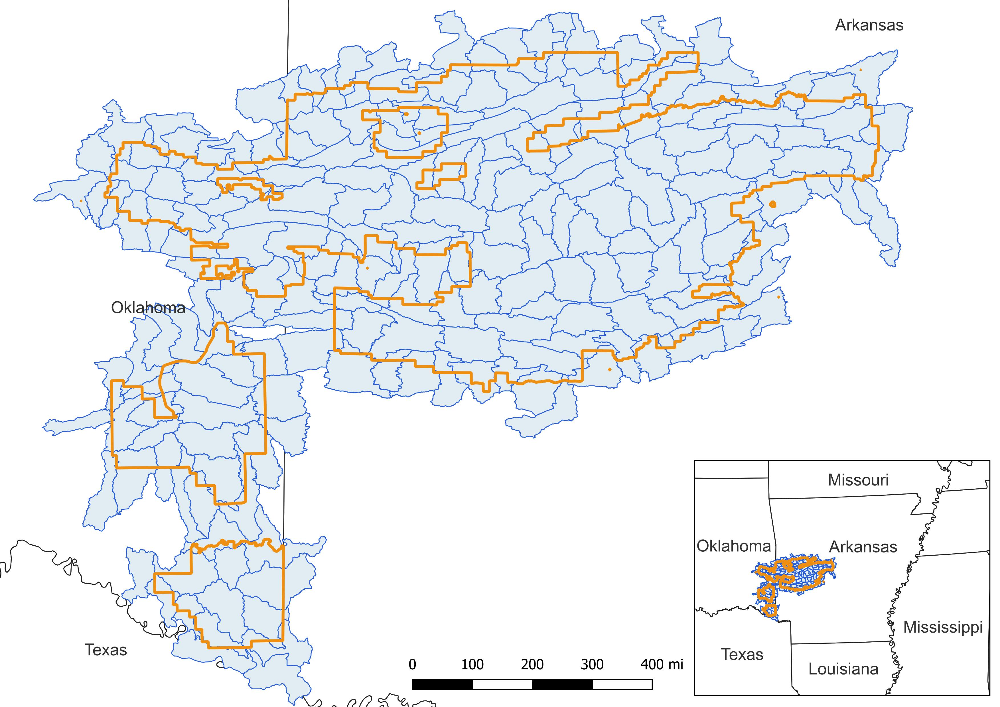
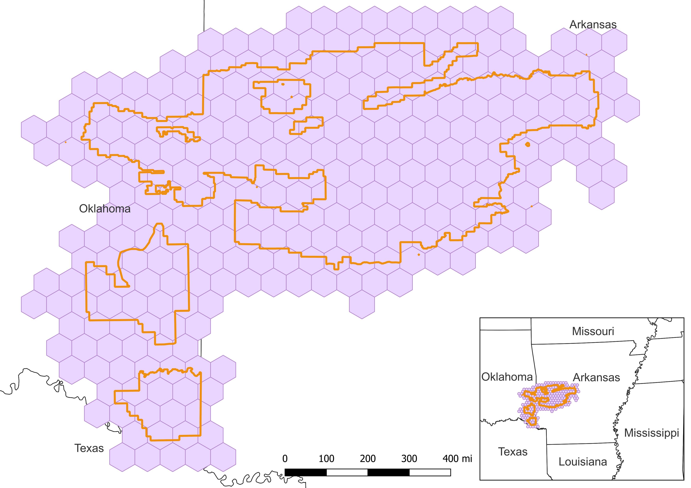

Below we outline some of the basics of the polygons used in this exploration, the Land Type Associations (LTAs), HUC 12 watersheds and the hexagons.

## Land Type Associations

The selected National Forest had 408 LTAs, ranging in size from ~800 - 22,000 ha, with an average of ~4,000ha.  

 

{style="float:right; margin-left: 25px;" fig-alt="\"Provisional LTAs." fig-align="right" width="900" }

## HUC 12 Watersheds

The selected National Forest had 199 huc 12 watersheds, ranging from ~4,100 - 17,000ha with an average of 9317ha.

 

{style="float:right; margin-left: 25px;" fig-alt="\"Provisional LTAs." fig-align="right" width="900" }

## Hexagons

We set hexagon size at 25,000 ha (on the large end) which resulted in 288 hexagons.

 

{style="float:right; margin-left: 25px;" fig-alt="\"Provisional LTAs." fig-align="right" width="900" }

